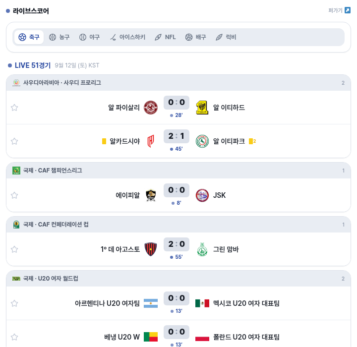
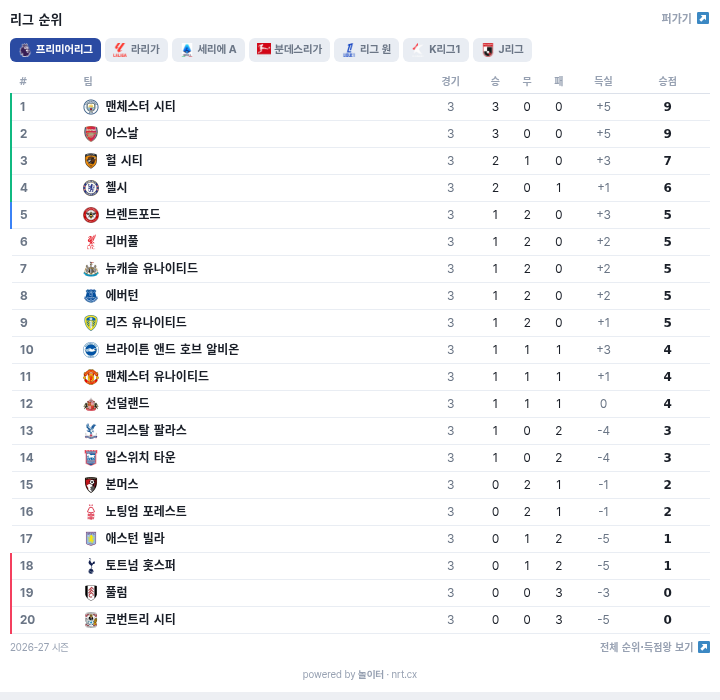
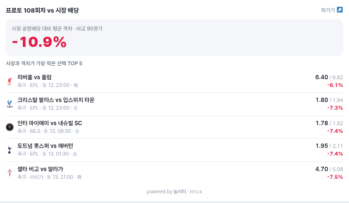
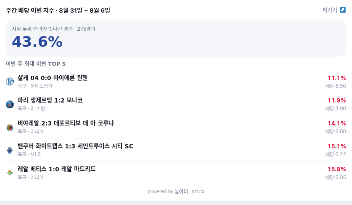

# noritur-widgets

스크립트 한 줄로 블로그·홈페이지에 붙이는 스포츠 위젯 모음입니다. 데이터는 [놀이터 nrt.cx](https://nrt.cx)가 실시간으로 갱신하고, 위젯은 iframe 으로 렌더링되며 높이가 내용에 맞춰 자동으로 조절됩니다. 가입, API 키, 설치 없음.

**[데모 페이지에서 실제 동작 보기](https://gildonghong484.github.io/noritur-widgets/)**

| 위젯 | 내용 | 갱신 |
|---|---|---|
| 라이브스코어 | 축구·농구·야구·아이스하키·NFL·배구·럭비 실시간 스코어, 종목 탭 | 실시간 |
| 리그 순위표 | 최대 8개 리그 탭 (EPL, 라리가, 세리에A, 분데스리가, 리그1, K리그1, J리그, KBO 등) | 매일 |
| 프로토 회차 리포트 | 이번 회차 고정배당과 시장 공정배당의 평균 격차, 격차가 가장 작은 선택 TOP 5 | 회차마다 |
| 주간 이변 지수 | 이번 주 시장 우세가 빗나간 비율과 최대 이변 경기 TOP 5 | 매주 |

## 빠른 시작

붙이고 싶은 자리에 아래 두 줄을 넣으면 끝입니다. `<a>` 줄은 위젯 아래에 붙는 출처 표기입니다.

```html
<script src="https://nrt.cx/embed.js" data-widget="live" data-sport="soccer" data-theme="light"></script>
<a href="https://nrt.cx/p/sports/live">축구 실시간 라이브스코어 - 놀이터</a>
```

티스토리·네이버 블로그·워드프레스·그누보드 등 HTML 을 직접 넣을 수 있는 곳이면 어디든 됩니다. 폭은 부모 요소를 100% 채웁니다.

## 위젯별 옵션

### 1. 라이브스코어 `data-widget="live"`



```html
<script src="https://nrt.cx/embed.js" data-widget="live" data-sport="soccer" data-theme="light"></script>
<a href="https://nrt.cx/p/sports/live">축구 실시간 라이브스코어 - 놀이터</a>
```

| 속성 | 값 | 기본 |
|---|---|---|
| `data-sport` | `soccer` `basketball` `baseball` `icehockey` `football`(NFL) `volleyball` `rugby` | `soccer` |
| `data-theme` | `light` `dark` | `light` |
| `data-height` | 고정 높이(px). 생략하면 내용에 맞춰 자동 | 자동 |

### 2. 리그 순위표 `data-widget="standings"`



```html
<script src="https://nrt.cx/embed.js" data-widget="standings" data-leagues="epl,laliga,seriea,bundesliga,ligue1,kleague,jleague" data-theme="light"></script>
<a href="https://nrt.cx/p/sports/league/4328">프리미어리그 순위표 - 놀이터</a>
```

| 속성 | 값 | 기본 |
|---|---|---|
| `data-leagues` | 쉼표로 구분한 리그 별칭, 최대 8개. 첫 번째가 기본 탭 | 주요 7개 리그 |
| `data-rows` | 표시할 순위 수 (예: `10` 이면 상위 10팀만) | 전체 |
| `data-theme` | `light` `dark` | `light` |
| `data-height` | 고정 높이(px) | 자동 |

리그 별칭: `epl` `laliga` `seriea` `bundesliga` `ligue1` `kleague` `jleague` `kbo`. 별칭이 없는 리그는 [놀이터 리그 페이지](https://nrt.cx/p/sports/leagues) 주소 끝의 숫자 id 를 그대로 넣으면 됩니다.

### 3. 프로토 회차 리포트 `data-widget="proto"`



```html
<script src="https://nrt.cx/embed.js" data-widget="proto" data-theme="light"></script>
<a href="https://nrt.cx/p/proto/report">프로토 회차 리포트 - 놀이터</a>
```

회차가 바뀌면 자동으로 새 회차를 보여 줍니다. 산출 방법과 전체 표는 [리포트 페이지](https://nrt.cx/p/proto/report)에 있습니다.

### 4. 주간 이변 지수 `data-widget="upsets"`



```html
<script src="https://nrt.cx/embed.js" data-widget="upsets" data-theme="light"></script>
<a href="https://nrt.cx/p/sports/upsets">주간 배당 이변 지수 - 놀이터</a>
```

## 자주 묻는 것

- **한 페이지에 여러 개 넣어도 되나요?** 됩니다. 위젯마다 스크립트 한 줄씩 넣으면 각각 독립적으로 높이를 맞춥니다.
- **다크 테마 블로그인데요.** `data-theme="dark"` 를 붙이세요.
- **높이가 계속 변하는 게 싫어요.** `data-height="600"` 처럼 고정하세요. 내용이 길면 내부에서 잘립니다.
- **출처 링크 줄을 빼도 되나요?** 스크립트가 위젯 아래에 작은 출처 표기를 자동으로 넣습니다. `<a>` 줄을 남겨 두면 그 줄이 대신 쓰입니다.
- **데이터 출처가 어디인가요?** 놀이터가 수집·검증한 데이터입니다. 순위표와 스코어는 공식 결과 기준이며, 리포트류는 각 페이지에 산출 방법이 적혀 있습니다.
- **상업 사이트에 써도 되나요?** 됩니다. 위젯 코드는 MIT, 데이터 표시는 놀이터 출처 표기가 유지되는 한 자유입니다.

## 예제

`examples/` 폴더에 위젯별 단일 HTML 파일이 있습니다. 브라우저에서 바로 열어 보면 됩니다.

## 문의

버그나 리그 추가 요청은 [Issues](https://github.com/gildonghong484/noritur-widgets/issues)에 남겨 주세요. 사이트: [nrt.cx](https://nrt.cx) · 블로그: [noritur.com](https://noritur.com)
